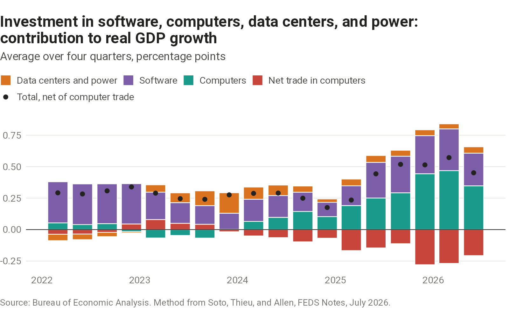
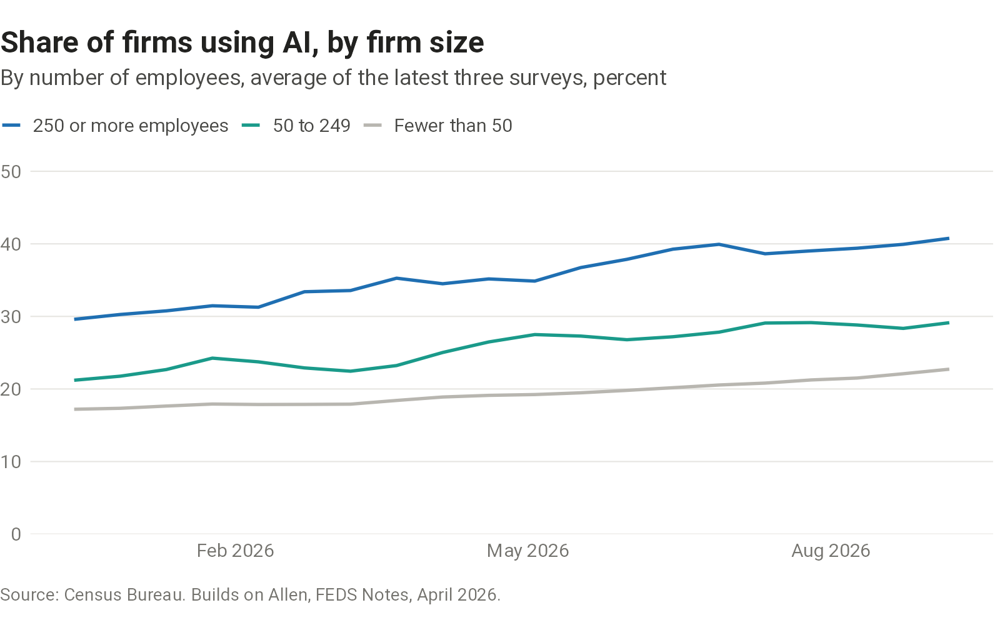
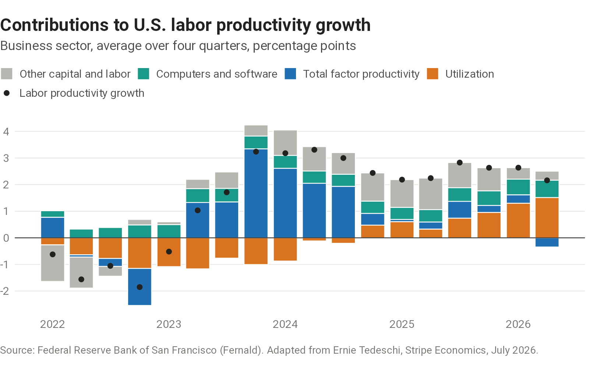

Charts on how AI shows up in U.S. economic data.

## Investment

Investment in software, computers, data centers, and power is where spending on AI appears in GDP, and its contribution to GDP growth is widely cited. Many of the computers are imported, and imports subtract from GDP, so the chart shows net trade in computers alongside the investment. The method follows a [July 2026 Federal Reserve note](https://www.federalreserve.gov/econres/notes/feds-notes/the-ai-buildout-and-the-economy-publicly-available-data-to-assess-ais-impact-20260717.html) by Soto, Thieu, and Allen.

```{=html}
<picture>
  <source media="(max-width: 600px)" srcset="charts/ai-investment-gdp/output/ai-investment-gdp-narrow.png">
  
</picture>
```

::: {.chart-source}
[Sources, definitions, and data](sources.qmd#ai-investment-gdp)
:::

## Adoption

How widely businesses use AI, and whether use spreads from large firms to small ones, bears on how much AI will change the economy. The Census Bureau asks businesses every two weeks whether they used AI and publishes the answers by firm size. The chart builds on an [April 2026 Federal Reserve note](https://www.federalreserve.gov/econres/notes/feds-notes/monitoring-ai-adoption-in-the-u-s-economy-20260403.html) by Allen.

```{=html}
<picture>
  <source media="(max-width: 600px)" srcset="charts/ai-adoption/output/ai-adoption-narrow.png">
  
</picture>
```

::: {.chart-source}
[Sources, definitions, and data](sources.qmd#ai-adoption)
:::

## Productivity

If AI makes businesses more efficient, it should show up in total factor productivity: output growth not explained by more capital, more skilled workers, or businesses working their existing staff and equipment harder. Splitting labor productivity growth into those parts separates efficiency gains from the rest. The chart adapts [Ernie Tedeschi's July 2026 analysis](https://www.stripeeconomics.com/p/ai-and-productivity) for Stripe.

```{=html}
<picture>
  <source media="(max-width: 600px)" srcset="charts/productivity-decomposition/output/productivity-decomposition-narrow.png">
  
</picture>
```

::: {.chart-source}
[Sources, definitions, and data](sources.qmd#productivity-decomposition)
:::
