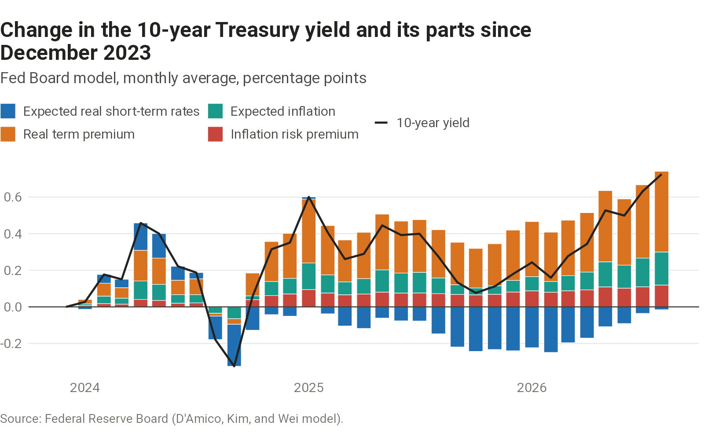
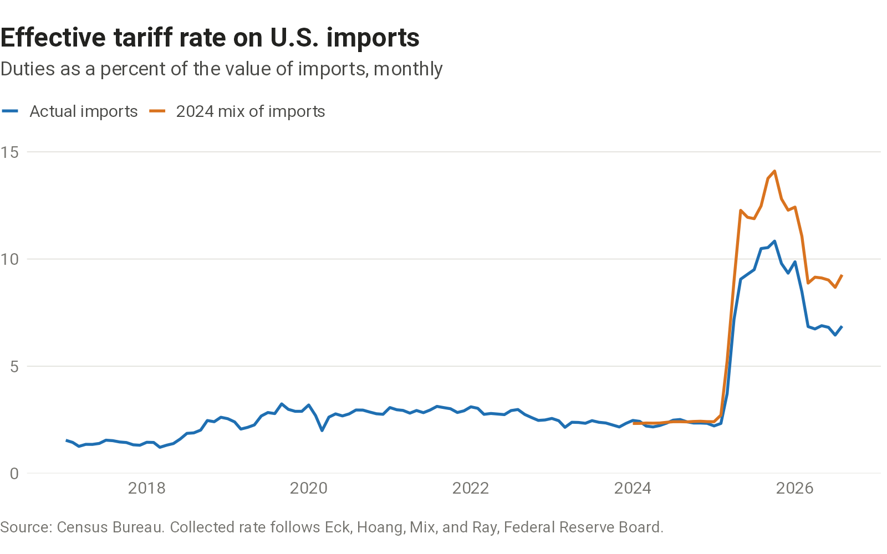

```{=html}
<div class="hero">
  
  <div>
    <p class="name">Nicholas Baulch</p>
    <p class="tagline">Economist</p>
    <p class="contact"><a href="mailto:nicholas.baulch@gmail.com">Email</a><a href="https://www.linkedin.com/in/nbaulch">LinkedIn</a><a href="https://github.com/nbaulch">GitHub</a><a href="resume.html">Resume</a></p>
  </div>
</div>
```

I'm an economist at U.S. Bank, where I lead scenario design, building the economic scenarios behind the bank's stress tests and loss reserves.

Before that, I spent four years at the U.S. Treasury. I was the lead economist on Ukraine after Russia's 2022 invasion and coordinated Treasury's backstop of the Federal Reserve's emergency lending facilities during COVID-19. I also served as senior advisor to the Acting Deputy Secretary after the 2020 transition.

I live in the Charlotte area with my wife and our twins. I grew up in Ohio and have since lived in South Carolina, Wisconsin, D.C., and Minnesota. Outside work, I run, bike, lift, read fantasy, and play board games.

Most of my work is built in R, and lately I've been using AI tools to do more of it. This site is one result: a small set of charts on the U.S. economy that I keep current. Many extend analyses by other economists that I thought were worth maintaining.

## Charts I'm watching {.topics-heading}

```{=html}
<div class="topics">
  <a class="topic" href="ai-economy.html">
    
    <span><span class="topic-name">The AI economy</span><span class="topic-description">Investment, adoption, and productivity</span></span>
  </a>
  <a class="topic" href="interest-rates.html">
    
    <span><span class="topic-name">Interest rates</span><span class="topic-description">The 10-year Treasury yield and who is supplying long-term debt</span></span>
  </a>
  <a class="topic" href="inflation.html">
    
    <span><span class="topic-name">Inflation</span><span class="topic-description">Measures of consumer price inflation</span></span>
  </a>
  <a class="topic" href="trade.html">
    
    <span><span class="topic-name">Trade</span><span class="topic-description">Tariffs and the goods trade balance</span></span>
  </a>
</div>
```

## Data releases

The latest release of each report, updated on release day.

- [Trade](trade-release.qmd): the monthly report on U.S. international trade in goods and services
