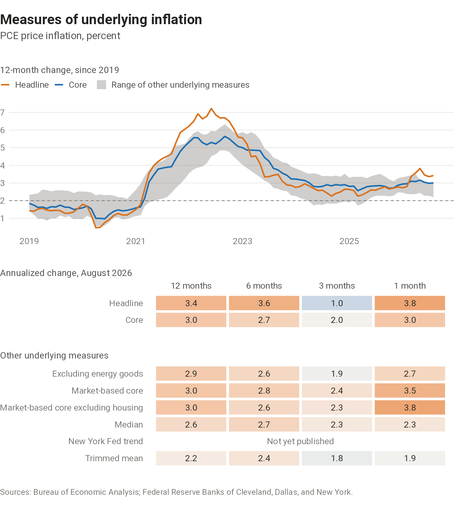
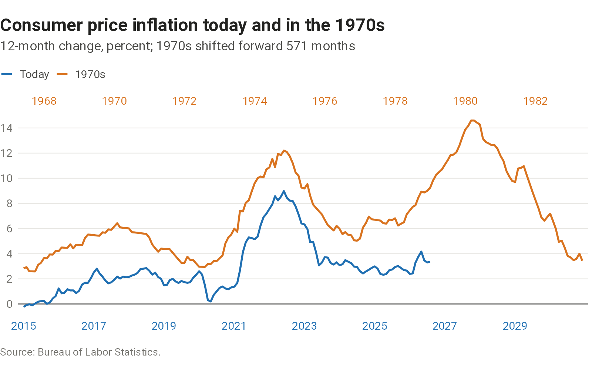
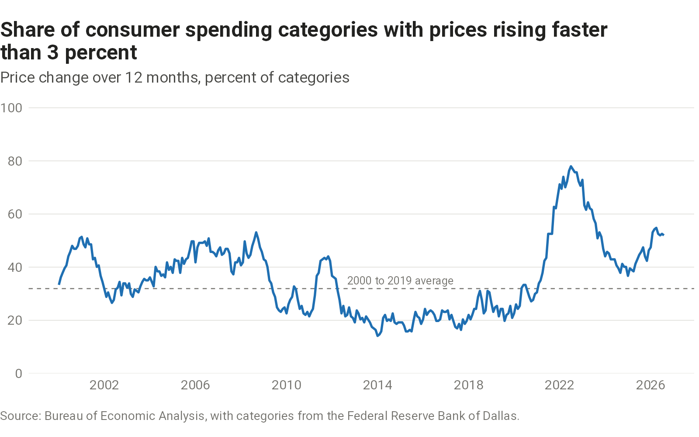
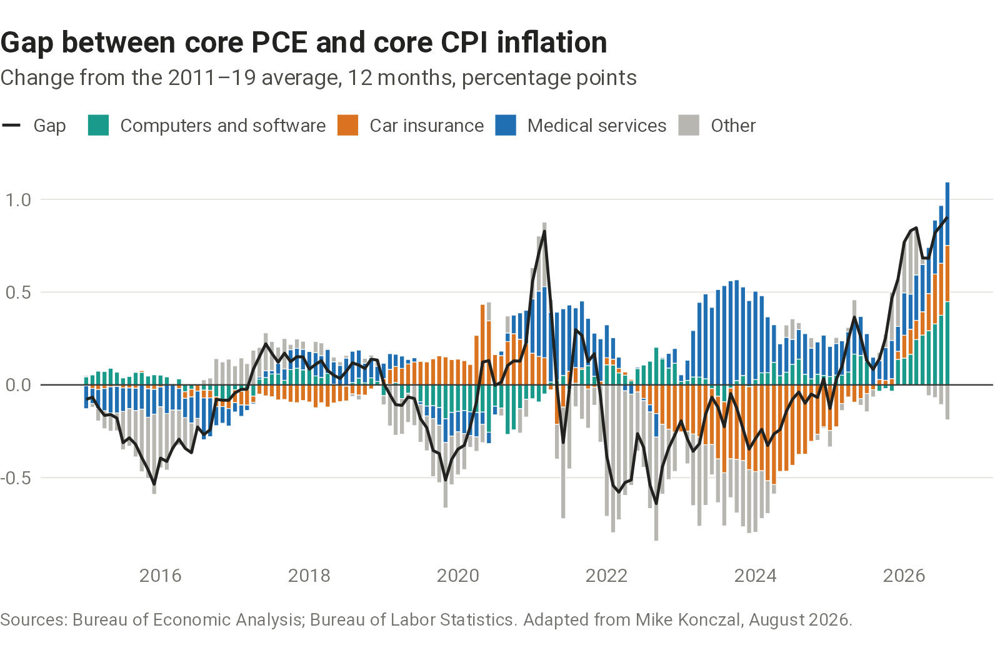
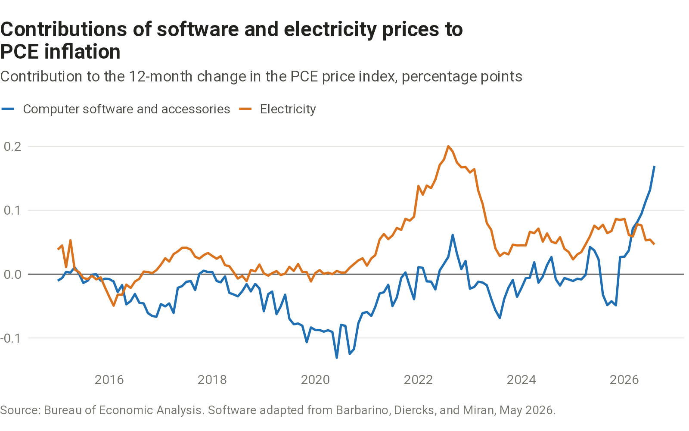

## Underlying inflation

```{=html}
<picture>
  <source media="(max-width: 600px)" srcset="charts/inflation-measures/output/inflation-measures-narrow.png">
  
</picture>
```

::: {.chart-source}
[Sources and data](sources.qmd#inflation-measures)
:::

## The 1970s

Is inflation today tracking inflation from the 1970s? Probably not, but this continues to be a fun chart that's been circling around for the past few years.

```{=html}
<picture>
  <source media="(max-width: 600px)" srcset="charts/inflation-1970s/output/inflation-1970s-narrow.png">
  
</picture>
```

::: {.chart-source}
[Sources and data](sources.qmd#inflation-1970s)
:::

## Breadth

Price increases spread across many categories are harder to attribute to one-off shocks. Kevin Warsh [cited this measure](https://www.federalreserve.gov/newsevents/speech/warsh20260828a.htm) at Jackson Hole in August 2026.

```{=html}
<picture>
  <source media="(max-width: 600px)" srcset="charts/inflation-breadth/output/inflation-breadth-narrow.png">
  
</picture>
```

::: {.chart-source}
[Sources and data](sources.qmd#inflation-breadth)
:::

## PCE and CPI

Pre-pandemic, core CPI tended to run about 35bps hotter than core PCE. That’s flipped in 2026, with core PCE now running 50bps hotter. The biggest drivers in the change are computers/software and medical services, which are more heavily weighted in the PCE basket. Car insurance prices are now falling—another contributor to the higher gap given its lower weight in the PCE basket. Given AI trends and demographics, it’s hard to see these first two trends going back to “normal” any time soon.

```{=html}
<picture>
  <source media="(max-width: 600px)" srcset="charts/pce-cpi-gap/output/pce-cpi-gap-narrow.png">
  
</picture>
```

::: {.chart-source}
[Sources and data](sources.qmd#pce-cpi-gap)
:::

## Software and electricity

Software and electricity are the consumer prices most directly tied to AI: one as a product, the other as an input for data centers. Federal Reserve Board economists [have examined](https://www.federalreserve.gov/econres/notes/feds-notes/measurement-of-computer-software-and-accessories-inflation-20260522.html) how well software prices are measured, and Dallas Fed economists [have estimated](https://www.dallasfed.org/research/economics/2026/0305-kay-datacenters) how data center demand affects electricity prices. The chart adapts the Board economists' analysis.

```{=html}
<picture>
  <source media="(max-width: 600px)" srcset="charts/software-electricity-prices/output/software-electricity-prices-narrow.png">
  
</picture>
```

::: {.chart-source}
[Sources and data](sources.qmd#software-electricity-prices)
:::
