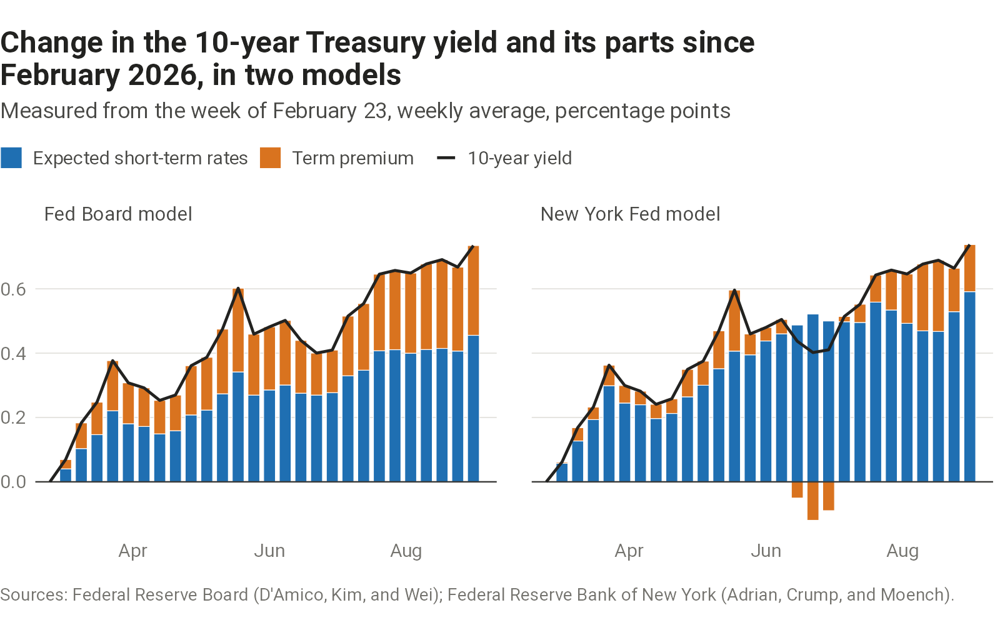
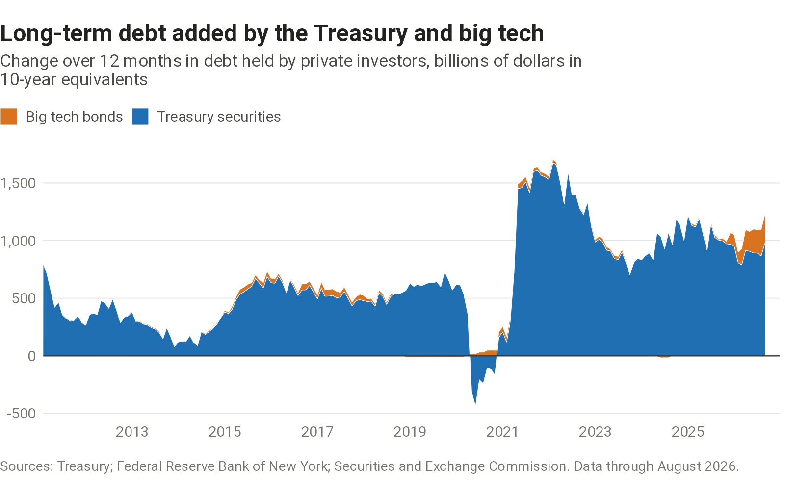

## The 10-year yield

The 10-year Treasury yield sets the cost of long-term borrowing. The Fed Board's model splits it into expected short-term rates, expected inflation, and the extra return investors require to hold a long-term bond. The split bears on debates over how fiscal policy, Treasury supply, and borrowing for AI affect long-term rates.

```{=html}
<picture>
  <source media="(max-width: 600px)" srcset="charts/yield-decomposition/output/yield-decomposition-narrow.png">
  
</picture>
```

::: {.chart-source}
[Sources and data](sources.qmd#yield-decomposition)
:::

## Two models

Models of the term premium can split the same change in yields differently. The chart shows the two most widely cited, from the Fed Board and the New York Fed, side by side.

```{=html}
<picture>
  <source media="(max-width: 600px)" srcset="charts/yield-rise-by-model/output/yield-rise-by-model-narrow.png">
  
</picture>
```

::: {.chart-source}
[Sources and data](sources.qmd#yield-rise-by-model)
:::

## Supply of long-term debt

Investors have to absorb new long-term debt whoever issues it, and more of it can raise the term premium. Large technology companies now borrow for AI alongside the Treasury. Measuring both in 10-year equivalents puts them on a common footing, following work by the [Dallas Fed](https://www.dallasfed.org/research/economics/2026/0210-searls-aifinancing) and Exante Data.

```{=html}
<picture>
  <source media="(max-width: 600px)" srcset="charts/duration-supply/output/duration-supply-narrow.png">
  
</picture>
```

::: {.chart-source}
[Sources and data](sources.qmd#duration-supply)
:::
