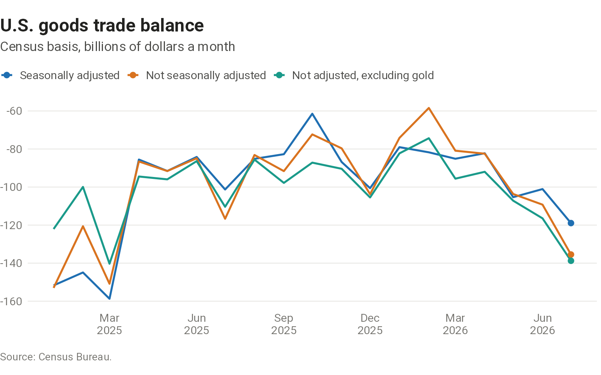
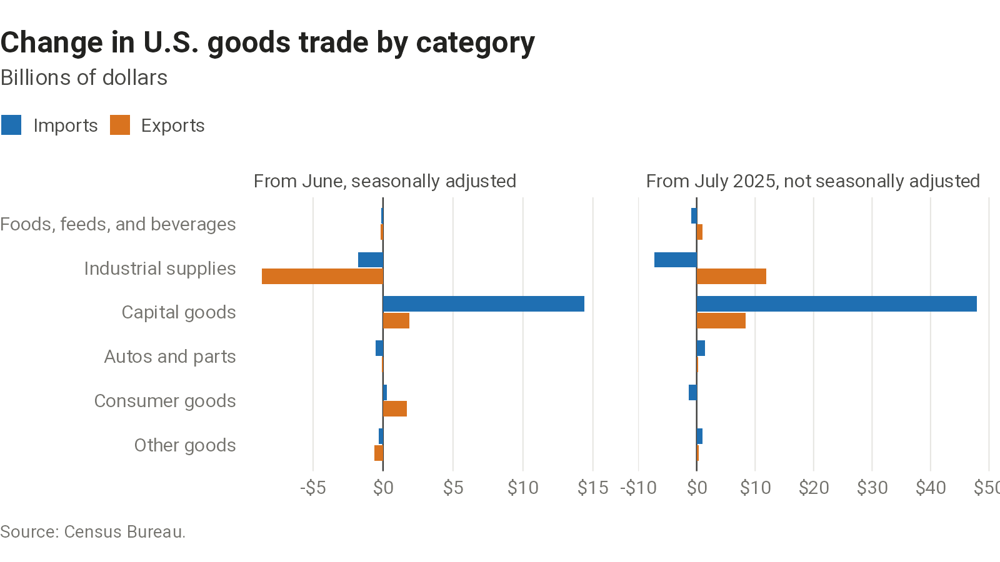
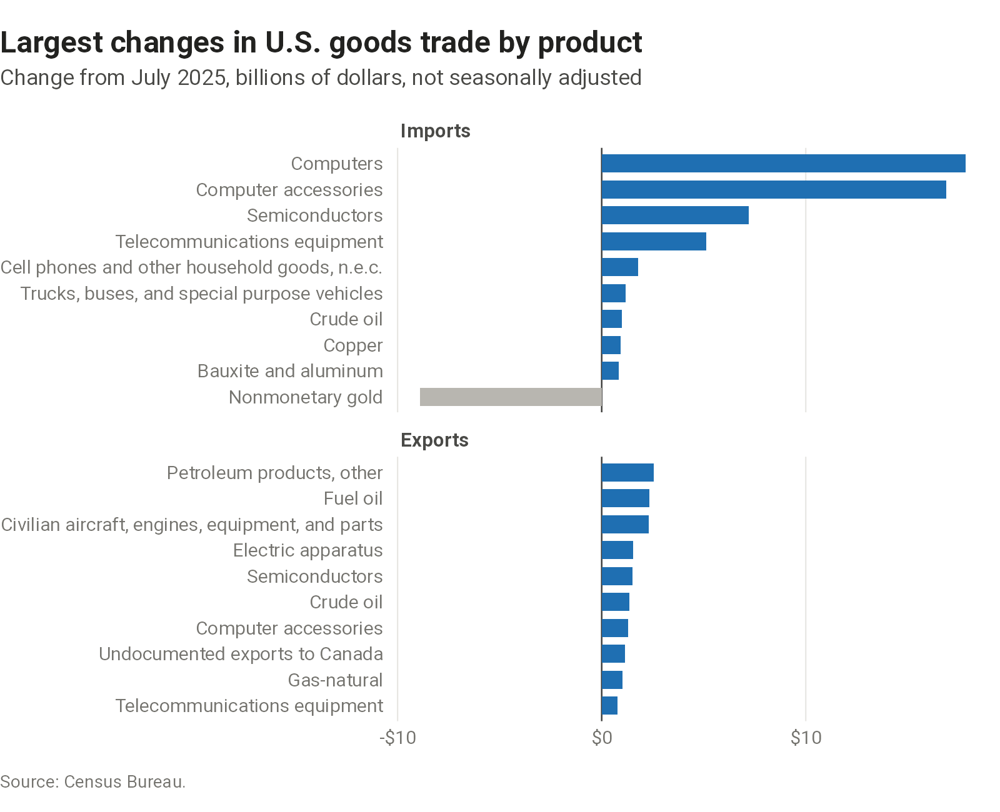
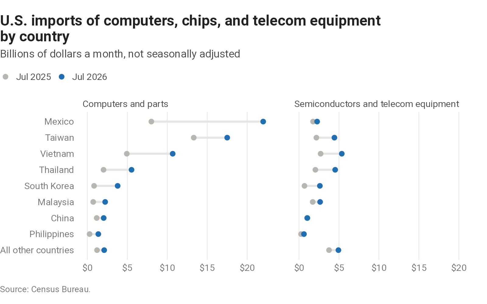



A view of the latest monthly report on U.S. international trade in goods and services from the Census Bureau and the Bureau of Economic Analysis. Seasonal adjustment of trade data has been harder since 2020, so where the data allow, the page shows figures both seasonally adjusted and not: the first compare with the previous month, the second with the same month a year earlier.

## Headline

Seasonally adjusted, balance of payments basis, billions of dollars. The previous month is as revised in this release; the revision is from the figure published a month earlier.



The goods balance below is on a Census basis, seasonally adjusted and not, and not adjusted without gold, whose trade can move for reasons of its own. Gold is defined as on the [goods balance chart](trade.qmd#goods-trade-balance).

```{=html}
<picture>
  <source media="(max-width: 600px)" srcset="charts/trade-release/output/goods-balance-narrow.png">
  
</picture>
```

## Goods in chained dollars

Goods trade in chained 2017 dollars, seasonally adjusted, Census basis, billions of dollars a month: the average over the quarter so far against the average over the previous quarter, the comparison that enters quarterly GDP. The balance is exports less imports.



## By category

Change in exports and imports by end-use category, seasonally adjusted from the previous month and not seasonally adjusted from a year earlier.

```{=html}
<picture>
  <source media="(max-width: 600px)" srcset="charts/trade-release/output/end-use-changes-narrow.png">
  
</picture>
```

## By product

The ten detailed end-use categories with the largest change in dollars from a year earlier, for imports and for exports. Census does not seasonally adjust trade at this detail.

```{=html}
<picture>
  <source media="(max-width: 600px)" srcset="charts/trade-release/output/product-changes-narrow.png">
  
</picture>
```

## Computers, chips, and telecom equipment by country

Imports of computers and parts, and of semiconductors and telecom equipment, bear on estimates of AI investment and its effect on GDP. The chart shows where they come from, in the latest month and a year earlier, for the eight countries with the most imports of the two combined. The product groups are the Census end-use categories used on the [goods balance chart](trade.qmd#goods-trade-balance).

```{=html}
<picture>
  <source media="(max-width: 600px)" srcset="charts/trade-release/output/hardware-by-country-narrow.png">
  
</picture>
```

## By country

Goods balance with the twelve countries whose balances are largest either way, Census basis, billions of dollars. The balance and the change from the previous month are seasonally adjusted; the change from a year earlier is not. Census does not find seasonal patterns in trade with Ireland and the Netherlands, so their figures are not adjusted in either column.



## Tariffs

Duties calculated on imports each month, and for the ten countries whose imports paid the most duty in the latest month. The tariff rate is duties as a percent of the customs value of imports for consumption.

```{=html}
<picture>
  <source media="(max-width: 600px)" srcset="charts/trade-release/output/duties-narrow.png">
  
</picture>
```



::: {.chart-source}
Source: Census Bureau, U.S. International Trade in Goods and Services (FT-900), exhibits 1, 6, 10, and 19, and U.S. imports and exports of merchandise by end-use category, product, and country. Data: [goods balance](charts/trade-release/output/goods-balance.csv), [categories](charts/trade-release/output/end-use-changes.csv), [products](charts/trade-release/output/product-changes.csv), [computers and chips by country](charts/trade-release/output/hardware-by-country.csv), [countries](charts/trade-release/output/partners.csv), [duties](charts/trade-release/output/duties.csv).
:::
