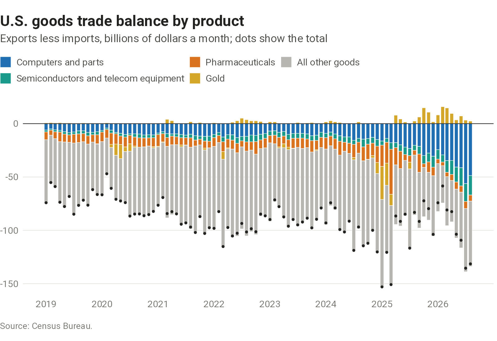

## Tariff rates

Announced tariffs and the duties importers pay differ because of exemptions, trade agreements, and shifts in what the United States buys and from where. The chart shows the rate collected on actual imports and, setting those shifts aside, at the 2024 mix of products and countries, following a [Federal Reserve Board note](https://www.federalreserve.gov/econres/notes/feds-notes/mind-the-gap-announced-versus-implied-tariff-rates-in-recent-trade-policy-episodes-20260408.html) by Eck, Hoang, Mix, and Ray. Both count duty when goods enter, before refunds such as those after the Supreme Court's February 2026 ruling.

```{=html}
<picture>
  <source media="(max-width: 600px)" srcset="charts/effective-tariff-rate/output/effective-tariff-rate-narrow.png">
  
</picture>
```

::: {.chart-source}
[Sources and data](sources.qmd#effective-tariff-rate)
:::

## Goods trade balance

Debates over the U.S. trade deficit often turn on a few product groups whose trade can move for reasons of its own: computers and chips, pharmaceuticals, and gold. The chart splits the goods balance into those groups and the rest, using the Census Bureau's product categories.

```{=html}
<picture>
  <source media="(max-width: 600px)" srcset="charts/goods-balance/output/goods-balance-narrow.png">
  
</picture>
```

::: {.chart-source}
[Sources and data](sources.qmd#goods-balance)
:::
